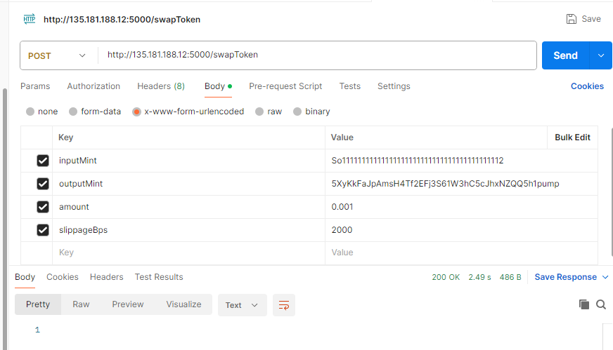

# Jupiter v6 SWAP API using Jito Bundle


## Environment Variables

To run this project, you will need to add the following environment variables to your .env file

```
QUIKNODE_RPC = "https://example.solana-mainnet.quiknode.pro/..."
JITO_RPC_URL = "https://mainnet.block-engine.jito.wtf/api/v1/bundle"
JUPITER_V6_API = "https://quote-api.jup.ag/v6"
PRIVATE_KEY = "YOUR WALLET PRIVATE KEY HERE"
```

## Run Locally

Clone the project

```bash
  git clone https://github.com/gungho0619/jupiter-v6-swap-api.git
```

Go to the project directory

```bash
  cd jupiter-v6-swap-api
```

Install dependencies

```bash
  npm install
```

Start the server

```bash
  npm run dev

  or

  yarn dev

```

## API Reference

#### SWAP Token

```http
  POST http://localhost:5000/swapToken
```

| Parameter | Type     | Example                |
| :-------- | :------- | :------------------------- |
| `inputMint` | `string` |  So11111111111111111111111111111111111111112 |
| `outputMint` | `string` | 5XyKkFaJpAmsH4Tf2EFj3S61W3hC5cJhxNZQQ5h1pump |
| `amount` | `number` | 0.001 |
| `slippageBps` | `number` | 2000 |



## Tech Stack

Node, Express, TypeScript, Jupiter, Jito_Bundle, @solana/web3

## Badges

[](https://choosealicense.com/licenses/mit/) [](https://opensource.org/licenses/)

## Authors

- [Flamingo](https://www.github.com/gungho0619)

## Feedback

If you have any feedback, please reach out to me via [mail](tzztson@gmail.com) or [telegram](https://t.me/gungho0619)
